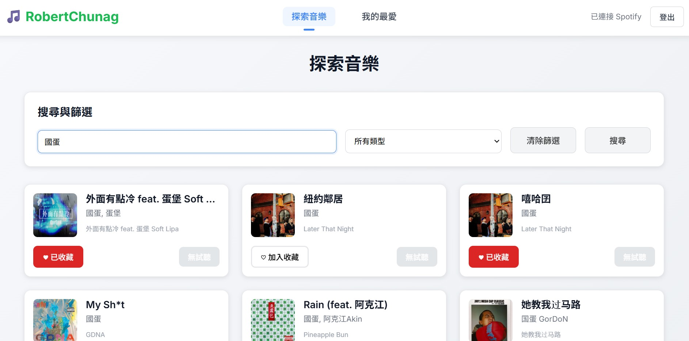
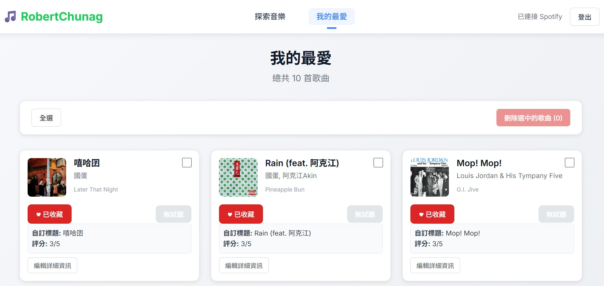

# YungChingHW 前端專案 

## 注意事項

> * 請務必將 `spotify.ts` 中的 `const CLIENT_ID` 替換為您自己的 Spotify Client ID&#x20;
> * 請務必將 `firebase.ts` 中的 `const firebaseConfig` 填入您 Firebase 專案的設定資訊&#x20;

## 專案介紹

這是一個結合 Spotify 音樂搜尋與 Firebase 收藏管理的線上音樂平台，提供使用者：

1. **即時音樂搜尋**：透過 Spotify API 搜尋歌曲、專輯、歌手，並依播放分類 (Category) 篩選結果。
2. **我的最愛管理**：將搜尋結果加入個人收藏，並在「我的最愛」頁面查看、編輯（備註、別名、評分等）或移除收藏項目，編輯操作內建格式驗證，確保資料正確。
3. **跨裝置同步**：收藏與編輯資料即時儲存在 Firebase Firestore，登入後可在不同裝置或瀏覽器同步使用。
4. **流暢單頁體驗**：採用 React SPA 架構與 RWD 設計，整合 Spotify OAuth 2.0 PKCE 驗證流程，提供無縫的音樂瀏覽與個人化服務。


---

## 功能設計

1. **首頁 – 資料列表**

   * 搜尋音樂並分頁顯示結果
   * 提供下拉選單，依 Spotify 分類 (Category) 篩選播放清單
   * 勾選單筆或多筆後加入「我的最愛」
2. **我的最愛列表**

   * 分頁顯示已收藏的曲目清單
   * 單筆編輯（可編輯備註、別名、評分）並通過基本驗證 (如：備註不可空白) 後儲存
   * 勾選單筆或多筆後移除收藏
3. **頁面切換**

   * 在「首頁」與「我的最愛」頁面提供相互連結
4. **視覺與版控**

   * 使用 SCSS 自行切版與設計，並確保寬度變化時排版正常 (RWD)
   * 使用 Git 進行版本控制
  
   * 

## 技術與工具

* **框架與語言**：React、TypeScript、Vite
* **樣式**：SCSS、CSS Modules
* **路由**：React Router
* **狀態管理**：React Context + localStorage
* **HTTP Client**：Axios
* **認證流程**：Spotify OAuth 2.0 (PKCE)&#x20;
* **後端服務**：Firebase Firestore (儲存收藏)、Firebase Auth (驗證)&#x20;
* **版控與部署**：Git、GitHub

## 環境設定

1. **安裝依賴**

   ```bash
   npm install
   ```
2. **Spotify Client ID**

   * 開啟 `src/services/spotify.ts`
   * 將 `const CLIENT_ID = '...';` 修改為您在 [Spotify Developer Dashboard](https://developer.spotify.com/dashboard/) 申請的 Client ID&#x20;
3. **Firebase 設定**

   * 在 Firebase 控制台建立專案並啟用 Firestore
   * 開啟 `src/services/firebase.ts`
   * 將 `const firebaseConfig = { ... }` 改為您專案的設定資訊&#x20;
4. **執行開發伺服器**

   ```bash
   npm run dev
   ```

---
